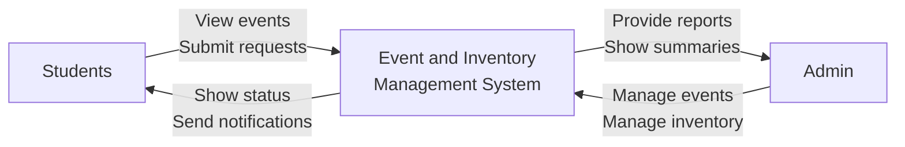

## ZDSPGC Event & Inventory Management System - Local Setup

### Installation Options

#### Option 1: Docker (Recommended for Development)

**Prerequisites:**

- Docker Desktop

**Services:**

- Web: PHP 8.2 + Apache (with PDO MySQL)
- DB: MySQL 8.0

**Quick start:**

```bash
docker compose up -d --build
```

Open: `http://localhost:8081` (change host port in `docker-compose.yml` if needed).

**Ports:**

- Web: host `8081` → container `80`
- MySQL: host `3307` → container `3306`

**Environment:**
App reads DB settings from env vars set in `docker-compose.yml` (`DB_HOST`, `DB_PORT`, `DB_DATABASE`, `DB_USERNAME`, `DB_PASSWORD`). See `config.php`.

**Database initialization:**
The file `docker/mysql/init.sql` creates the `users` table and seeds a default admin. It only runs on first DB startup; to re-run, remove the `db_data` volume:

```bash
docker compose down -v
docker compose up -d --build
```

**Common commands:**

```bash
docker compose logs -f web
docker compose logs -f db
docker compose exec web bash
docker compose down
```

---

#### Option 2: XAMPP (Quick Setup)

**Prerequisites:**

- XAMPP (includes MySQL/MariaDB)

**Setup Steps:**

1. **Download & Install XAMPP**

   - Download from [apachefriends.org](https://www.apachefriends.org/)
   - Install to your preferred location

2. **Start Services**

   - Open XAMPP Control Panel
   - Start **Apache** and **MySQL**

3. **Copy Project Files**

   - Copy this entire project folder to `C:\xampp\htdocs\` (or your XAMPP installation directory)
   - Folder structure: `C:\xampp\htdocs\ZDSPGC-EVENT-AND-INVENTORY-MANAGEMENT-SYSTEM\`

4. **Run Automatic Database Setup**

   - Open browser and go to: `http://localhost/ZDSPGC-EVENT-AND-INVENTORY-MANAGEMENT-SYSTEM/setup.php`
   - Enter your MySQL root password (usually blank for XAMPP)
   - Click "Run Setup"
   - Wait for success message

5. **Access Application**
   - Go to: `http://localhost/ZDSPGC-EVENT-AND-INVENTORY-MANAGEMENT-SYSTEM/login.php`
   - Login with default credentials:
     - **Username:** admin@example.com
     - **Password:** admin123

**Security Note:** Delete `setup.php` after installation completes!

---

### Default Admin Credentials

**After Setup:**

- **Username:** admin@example.com
- **Password:** admin123

**Please change this password immediately after first login!**

# ZDSPGC Event & Inventory Management System

A comprehensive web-based system for managing events and inventory at ZDSPGC (Zamboanga del Sur Provincial Government College).

## Project Overview / System Perspective

This diagram illustrates the high-level interactions between the system's main actors:



**System Interactions:**

- **Students** can view events, submit requests (for events and inventory items), and receive status updates and notifications
- **Admin** manages events and inventory, and receives comprehensive reports and system summaries
- The **System** acts as the central hub, facilitating all interactions and providing real-time status information

## Security Implementation

### Authentication System

- **PHP Session-based Authentication**: Secure server-side session management
- **Password Hashing**: All passwords are hashed using PHP's `password_hash()` function
- **Session Timeout**: Automatic logout after 1 hour of inactivity
- **Role-based Access Control**: Separate permissions for Admin and Student users
- **CSRF Protection**: Form-based protection against cross-site request forgery

### Security Features

- **Input Validation**: Server-side validation for all user inputs
- **SQL Injection Protection**: Prepared statements and parameterized queries
- **XSS Protection**: Output escaping and Content Security Policy headers
- **File Access Control**: Protected sensitive files and directories
- **Security Headers**: Comprehensive HTTP security headers via .htaccess

### Default Login Credentials

#### Admin User

- **Email**: admin@zdspgc.edu.ph
- **Password**: admin123
- **Role**: Administrator

#### Student User

- **Email**: student@zdspgc.edu.ph
- **Password**: student123
- **Role**: Student

## Features

### User Management

- **Dual User Types**: Admin and Student roles with different permissions
- **User Registration**: Self-registration with email validation
- **Profile Management**: User profile information and settings
- **Session Management**: Secure login/logout with session tracking

### Event Management

- **Event Creation**: Add new events with details and scheduling
- **Event Categories**: Organize events by type (Campus, Public, Internal)
- **Event Tracking**: Monitor event status and attendance
- **Calendar View**: Visual calendar interface for event management

### Inventory Management

- **Item Tracking**: Comprehensive inventory item management
- **Borrowing System**: Track item loans and returns
- **Stock Management**: Monitor quantities and low stock alerts
- **Category Organization**: Organize items by category and location

### Dashboard

- **Real-time Statistics**: Live updates of system metrics
- **Quick Actions**: Fast access to common tasks
- **Recent Activity**: Track system usage and changes
- **User-specific Views**: Different dashboards for Admin and Student users

## Technical Stack

### Backend

- **PHP 7.4+**: Server-side scripting and authentication
- **Session Management**: Secure PHP sessions with timeout
- **File-based Storage**: JSON-based data storage (can be upgraded to database)

### Frontend

- **HTML5**: Semantic markup
- **CSS3**: Modern styling with Bootstrap 5
- **JavaScript**: Interactive functionality and form validation
- **Bootstrap 5**: Responsive UI framework
- **Bootstrap Icons**: Icon library

### Security

- **HTTPS Ready**: Configured for secure connections
- **Content Security Policy**: XSS protection
- **Input Sanitization**: Server-side validation and sanitization
- **Session Security**: Secure session handling

## File Structure

```
ZDSPGC-EVENT-AND-INVENTORY-MANAGEMENT-SYSTEM/
├── auth.php                 # Authentication system
├── login.php               # Login and registration page
├── dashboard.php           # Main dashboard
├── index.php              # Events management
├── inventory.php          # Inventory management
├── logout.php             # Logout handler
├── .htaccess              # Security and server configuration
├── README.md              # This file
├── data/                  # Data storage directory
│   └── users.json        # User data (auto-generated)
├── scripts/               # JavaScript files
│   ├── dashboard.js      # Dashboard functionality
│   ├── inventory.js      # Inventory functionality
│   ├── login.js          # Login page functionality
│   └── script.js         # Common functionality
└── styles/               # CSS files
    ├── dashboard.css     # Dashboard styling
    ├── inventory.css     # Inventory styling
    ├── login.css         # Login page styling
    └── style.css         # Common styling
```

## Installation

1. **Server Requirements**:

   - PHP 7.4 or higher
   - Apache web server with mod_rewrite enabled
   - HTTPS support (recommended)

2. **Installation Steps**:

   ```bash
   # Clone or download the project
   # Place files in your web server directory

   # Set proper permissions
   chmod 755 data/
   chmod 644 data/users.json

   # Access the application
   http://your-domain/login.php
   ```

3. **First Time Setup**:
   - The system will automatically create default users on first run
   - Use the default credentials to log in
   - Change default passwords immediately after first login
